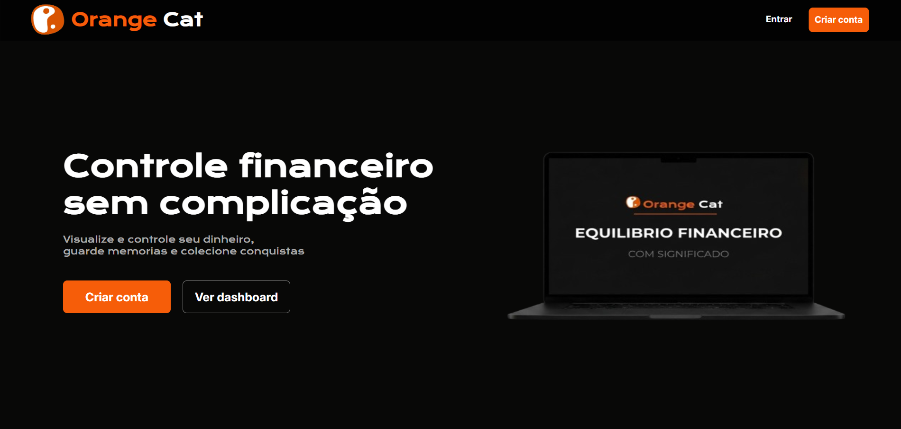
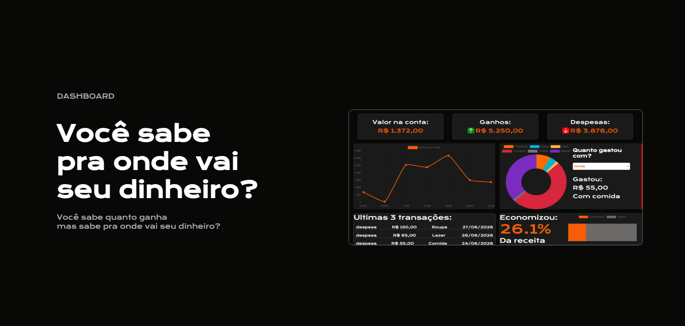
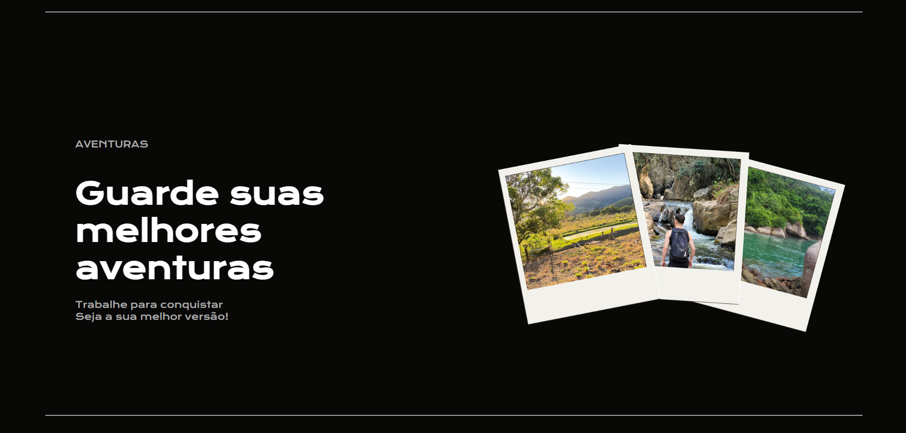
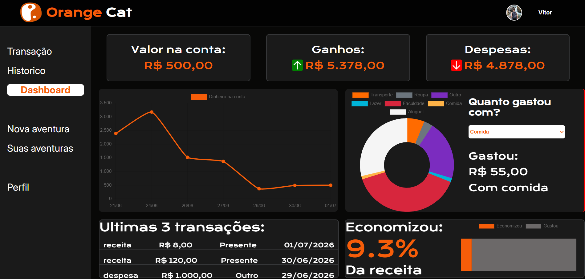
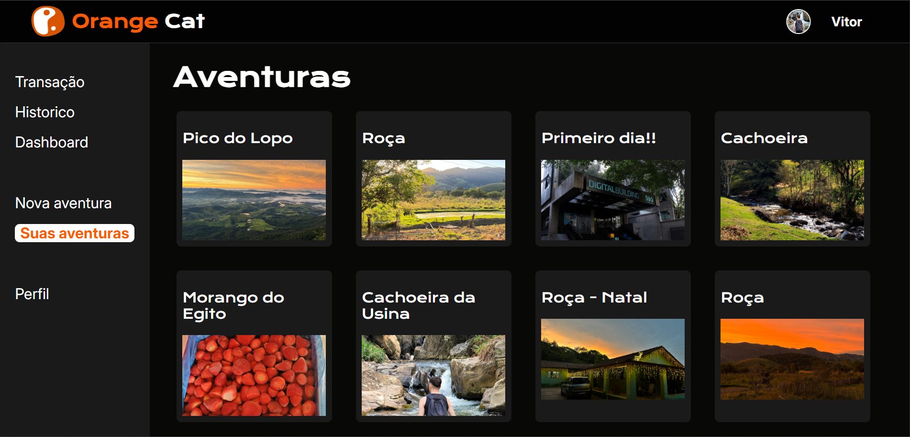

# Orange Cat

> Aplicação Web para Controle Financeiro Pessoal e Registro de Memórias.

O **Orange Cat** é uma plataforma intuitiva desenvolvida para ajudar jovens estudantes e trabalhadores a gerenciarem suas finanças sem burocracia ou planilhas complexas. Além do fluxo tradicional de entradas e saídas, o sistema conta com o módulo exclusivo **Aventuras**, permitindo associar economias financeiras a registros de memórias e conquistas reais.

---

## Demonstração

### Visão Geral da Home

### 📊 Dashboard Principal

### 📸 Módulo Aventuras

---

## 🛠️ Tecnologias Utilizadas

O projeto foi construído utilizando tecnologias modernas de desenvolvimento web focado em performance e experiência do usuário:

*   **Front-end:** HTML5, CSS3 e JavaScript (Vanilla)
*   **Gráficos:** Chart.js
*   **Back-end:** Node.js(API para recebimento, tratamento e envio de requisições)
*   **Banco de Dados:** MySQL (Persistência dos dados de usuários, finanças e aventuras)

---

## Alinhamento com as ODS (Metas da ONU)

Este projeto não é apenas uma ferramenta técnica, ele foi estruturado para gerar impacto social alinhado com os Objetivos de Desenvolvimento Sustentável da ONU:

*   **ODS 4 – Educação de Qualidade:** Atua como ferramenta prática de alfabetização financeira, ajudando jovens a vencerem a primeira barreira de como lidar com o dinheiro através de uma interface visual acessível.
*   **ODS 8 – Trabalho Decente e Crescimento Econômico:** Capacita o jovem trabalhador a administrar o que ganha, mitigando riscos de superendividamento precoce e gerando autonomia financeira no início da carreira.

---
